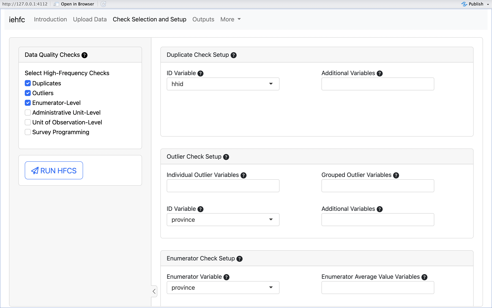

Real-time data quality checks, often referred to as “high-frequency checks” (HFCs) in international development research, are an essential component of conducting successful quantitative research. Usually composed of a set of data monitoring process that are run regularly throughout data collection, HFCs serve as a rapid-response method of identifying data issues as they arise. With HFCs, data collection teams can ensure that issues that would affect ongoing data collection are addressed as soon as possible, and that errors that cannot be solved post-data collection get resolved while data collection is ongoing.

While there is broad consensus in the field of development research on the need for high-frequency checks, and there are a few guides and examples of successful HFC processes and outputs, the process of implementing HFCs on a new project still proves to be challenging for development research teams. For RAs with coding experience who are tasked with designing HFCs, there are no current open-source resources on how to code up HFCs from scratch. t (see table below).

The iehfc Platform will serve to provide high-frequency check outputs that are easy to create, customize, and share. The iehfc Platform will thus make high-frequency checks more accessible to researchers of all levels of coding experience, while helping to standardize good data quality practices in development economic research.

Currently in development but [you can test the platform within this GitHub repo!](https://github.com/dime-worldbank/iehfc)
