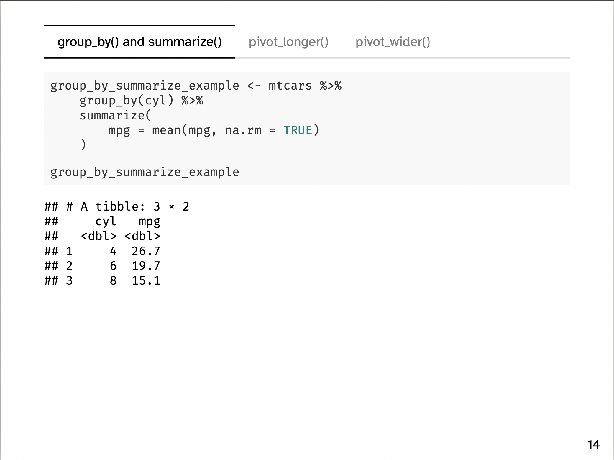

I have been teaching this course at Johns Hopkins University SAIS for the past four semesters to 15-20 students. The aim of the course is to prepare graduate students for the practical uses of statistical software in an entry-level research position; namely, cleaning and wrangling data, rather than complex econometric analyses. As a six-hour course, the aim is to provide the students with the knowledge of what is possible with R and where they can find additional information as they continue to develop their skills.

The resources are available below. Please feel free to submit an issue on the GitHub repository if you have any questions or comments!

Click on the links below to get access to:

- The data [Dropbox folder](https://www.dropbox.com/scl/fo/6m5hzlrc82i04oi0qoam7/h?rlkey=7t9p4bfg90gvoybibb9jf7veq&dl=0)

- The syllabus ([.html](https://mfiorina.github.io/sais_r_course/syllabus/r_course_syllabus.html) or [.pdf](https://mfiorina.github.io/sais_r_course/syllabus/r_course_syllabus.pdf))

- Session 1 slides ([.html](https://mfiorina.github.io/sais_r_course/slides/session_1/session_1.html))

- Session 2 slides ([.html](https://mfiorina.github.io/sais_r_course/slides/session_2/session_2.html))

- Session 3 slides ([.html](https://mfiorina.github.io/sais_r_course/slides/session_3/session_3.html))